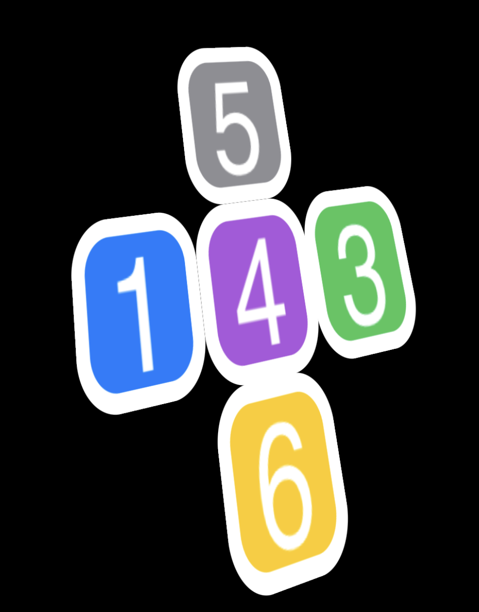
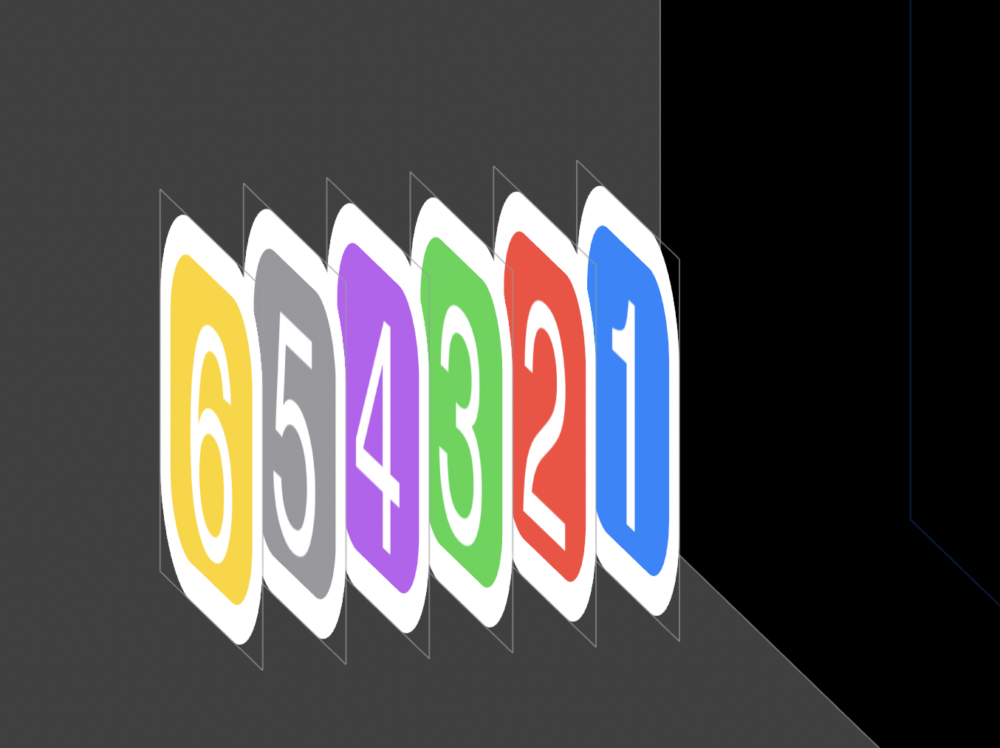

# CubeIn3DWithCoreAnimation

iOS Core Animation 3D cube demo, with notes on macOS transform differences.

This is an older sample project kept public because people still reference the
Core Animation cube experiment. The iOS/iPadOS version demonstrates a working
3D cube assembled from layers; the macOS target is intentionally documented as
unfinished because the same transform setup does not behave identically there.

Related write-up: [Core Animation 3D Cube](https://aleahim.com/blog/core-animation-3d-cube/).

## iOS Result

Assembled cube:

Flattened layout:

Animated cube:

## macOS Notes

The macOS target is present, but the layer transforms do not match the iOS
result. The screenshots below are kept as debugging notes rather than polished
output.

## Status

This is a historical demo, not an actively maintained package. Issues and pull
requests are still welcome if you are using it as a reference.

Video: [YouTube demo](https://www.youtube.com/watch?v=exIGbi36_bk)
